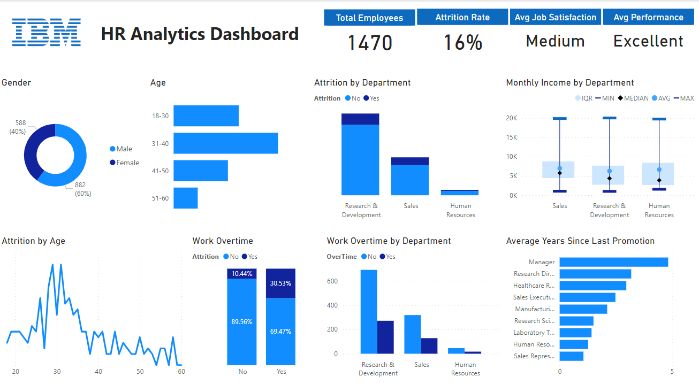

# IBM HR Analytics Dashboard

## Overview:
The IBM HR Analytics Dashboard project leverages the IBM HR Analytics dataset to create a Power BI dashboard, providing a comprehensive overview of employee dynamics within the organization. The dataset, available on Kaggle, includes crucial HR metrics such as attrition rates, job satisfaction, and demographic information.

Dataset on Kaggle: [IBM HR Analytics Attrition Dataset](302243322-594474c9-b0e1-409f-a2f3-cde8b02621e0.png)

## Key Questions:
1. What is the overall attrition rate in the company?
2. How does average job satisfaction and performance rating vary?
3. What is the gender and age distribution within the company?
4. Which department exhibits the highest attrition rate?
5. Which age group experiences the highest attrition?
6. How does monthly income vary across different departments?
7. Is there a correlation between working overtime and attrition?
8. How many employees work overtime in each department?
9. What is the average number of years since the last promotion for employees in different job roles?

## Summary Insights:

- The overall attrition rate is 16%, affecting 1470 employees in the dataset.
- Average job satisfaction is rated as medium, while the average performance rating is excellent.
- Gender distribution shows 60% male and 40% female employees.
- The largest age group falls within the 31-40 range.
- Research & Development department exhibits the highest attrition rate.
- Research & Development also has the lowest minimum and average monthly income.
- Employees aged 29-31 experience the highest attrition rates.
- Working overtime is correlated with increased attrition.
- Research & Development has the highest number of employees working overtime.
- Managerial roles have the highest average years since the last promotion, followed by research director and healthcare representative.

## Recommendations:
1. **Job Satisfaction:**
   - Investigate the factors contributing to the medium job satisfaction rating. Conduct surveys or interviews to gather feedback from employees and identify areas for improvement.
   - Develop initiatives to boost job satisfaction, such as recognition programs, flexible work arrangements, or training opportunities.

2. **Age Group Concerns:**
   - Given that the 29-30 age group experiences the highest attrition rates, explore the reasons behind this trend.
   - Implement strategies to retain and engage employees in this age group, such as providing career advancement opportunities

3. **Overtime Management:**
   - Recognize the correlation between working overtime and increased attrition. Consider optimizing workloads or offering additional support to departments, especially Research & Development, where overtime is prevalent.
   - Monitor and manage overtime hours to prevent burnout and ensure a healthy work-life balance.

4. **Income Disparities:**
   - Address the income disparities in the Research & Development department by evaluating and adjusting compensation structures if necessary.

5. **Promotion Opportunities:**
   - Focus on providing more promotion opportunities for employees in various roles, especially in departments with lower average years since the last promotion.
   - Implement mentorship programs or training initiatives to help employees develop the skills needed for career advancement.

## 🔗 Connect with Me
- **Email**: (Patilkrishnal2003@gmail.com)
- **LinkedIn**: [Patil Krishnal](https://linkedin.com/in/krishnal-patil-b1a5a6208/)
- **GitHub**: [Patilkrishnal2003](https://github.com/patilkrishnal2003)